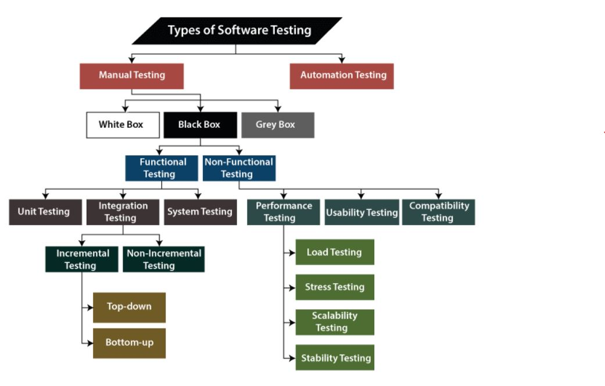
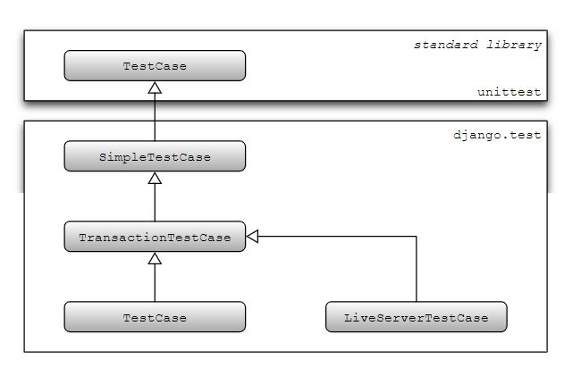

# Testing in Django

## What is software testing?
The process of checking an application or product does what it is actually suppose to do.

## What are the benefits of testing?
1. Testing is important because it allows us to detect all the defects/bugs before the delivery to the client.
2. It guarantees the <b>quality</b> of the software or product.

## Types of testing

<figure align = "center" width="100%">

<figcaption></figcaption>
</figure>

### Note:
1. There are many types of testing and its aliases. So, you might get confused easily.
2. So, remeber this in mind that same type of testing has different names for it & testing can overlap between each other.
3. The above picture is taken from https://www.javatpoint.com/types-of-software-testing and you can refer this website for learning more about the types of testing.
4. Our focus in this tutorial is to <b>perform automated unit testing in django.</b>


### Unit testing
A type of testing in which smallest testable part of the project is tested. These small parts are called units and these are tested independently for proper function.

### Automated unit testing
A set of tests is created once and then changes are made to the application. One can check if the code still works as intended originally, without having to perform manual testing, which is obviously time consuming.

## Few things to know
1. Django’s unit tests use a Python standard library module called <b>unittest.</b>
2. We define tests in a class-based approach in django.
3. You can write your tests in the `tests.py` file, which is created automatically when an app is created in a django project.
4. If you have few test cases, writing tests in `tests.py` will be a great choice. But what is the best way to write test cases if we have a lot of tests to perform?
5. You can create a new directory `tests` inside the app in which you want to perform test.
6. Inside this `tests` directory you can create multiple test files like <b>test_models.py, test_views.py, test_forms.py, etc.</b>
7. Also, dont forget to create a new file `__init__.py` to make the directory `tests` a module/package.
8. Test discovery is based on the unittest module’s built-in test discovery.
9. By default, this will discover tests in any file named <b>test*.py</b> 

### Hierarchy of Django unit testing classes

<figure align = "center" width="100%">

<figcaption></figcaption>
</figure>


#### A Simple Example
```
from django.test import SimpleTestCase

class TestTasks(SimpleTestCase):
    def test_simple_equation(self):
        assert 1 == 2
```


### Important django.urls utility functions
1. <b>reverse()</b>: It take these arguments (viewname, urlconf=None, args=None, kwargs=None, current_app=None) and returns URL.
2. <b>resolve()</b>: It take these arguments (path, urlconf=None) and path is the URL path we want to resolve. Returns ResolverMatch object that allows you to access various metadata about the resolved URL. If the URL does not resolve, the function raises a Resolver404 exception (a subclass of Http404) .

